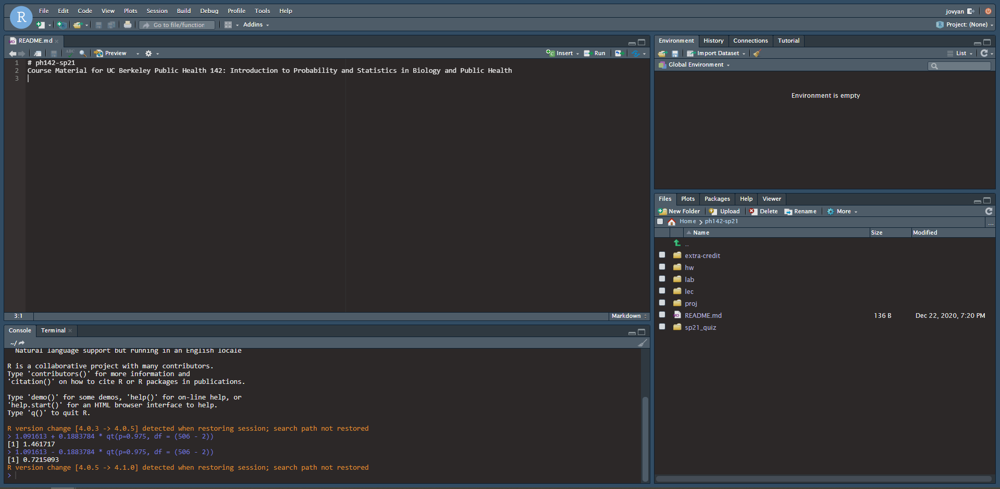
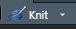

```{r, warning=F, message=F, echo=F}
library(dplyr)
library(ggplot2)
```

* Homework will not be submitted for marks and you are
encouraged to work on it in groups if that is how you learn best. 
Completing the homework is excellent preparation for the 
exams. All solutions will be posted on datahub a few days after the 
homework was made available.


* The goal of this assignment is for you to become familiar with the systems we will be using for this course and to practice submitting assignments using these systems.


--------------------------------------------------------------------------------

**Part 1 Ed ** 

Navigate to the course Ed site.  There is a link to our course Ed site on Bcourses.

If you have not used Ed before, take some time to get oriented. 
The left hand side of the screen will organize postings by when they were added, as well as keeping some "pinned" discussions at the top of the list.
We will keep the current week's announcements "pinned" so that you can easily locate the key announcements for the week.  
We will also use Ed for a weekly information updating you with relevant information for the current week of class.

Notice the topics along the left of the window - these indicate groupings so that you can navigate to particular topics more easily.

When you post, please be respectful.  To encourage everyone to participate we are allowing your posts to be anonymous to your classmates, however the instructor will be able to see who has posted and we will be monitoring the site. We reserve the right to remove posts that we feel are not in keeping with our Berkeley values of respectful scholarly discourse.  


--------------------------------------------------------------------------------

**Part II gradescope online quiz [1 point].** 
This course uses gradescope to submit and grade assignments.  You must create a gradescope account in order to submit your work.
We will also be using the online testing/quiz function in gradescope.  

You should have been added to our course gradescope site.  Make sure you have one (and only one) account set up on gradescope that includes your student ID number and email address.  If you have not been added to our gradescope site, or are having difficulty accessing it, please reach out on Ed.


--------------------------------------------------------------------------------

**Part III Datahub/R knit and submit [1 point].** 

We will be using R on Datahub for a large portion of the course materials.

We will spend more time this week introducing R.

The objective for this assignment is to make sure you can access Datahub, knit a document and submit manually to gradescope.

Follow the link on the course website to Datahub.  

You may be asked to sign in with your Berkeley credentials.  

Once you enter the site, you should see something like this:


```{r, echo=F, out.width = "40%", fig.align='center'}

```

The lower right panel shows your location.  
Navigate to the folder ph142-su21

You should then see folders for Homework "HW", lab and lectures.

Open the HW folder by double clicking and you should see the HW00.rmd file.
This is the markdown file that generates the pdf document that is also posted on the website.  

For most of your assignments there will an automated link that will submit your work directly to gradescope.  
However, there may be some assignments that you will edit in Datahub and submit manually.


To do this, open the hw00.rmd file in Datahub.  Edit the header of the document so that your name, student ID and the date show in the header between the quotation marks.  


Next add an answer to the question below by replacing the text [ your answer here ] with your answer to the question:  

Question 1.  
Do you currently have a pet:

[ your answer here ]


Now you will "knit" the file to create a pdf document.

Look at the top menu bar in RStudio. 
 
 You should see an icon of a little blue ball of yarn and the word knit:

```{r , echo=F, out.width = "40%", fig.align='center'}

```

Click this icon.  

This should generate a pdf document on your computer.  You can save this file and submit it to gradescope manually. To do this, click the checkbox next to the pdf you would like to download. Hit the "More" button with a gear next to it to reveal a drop down menu. Hit "Export" to save your file on your computer. 


* Submission process: Please submit a PDF of your assignment to gradescope.
Follow the navigation from the course website to the gradescope site.  
Select the assignment "Homework 00" and submit your assignment.  

For manually submitted assignments that may have a variable length (the number of pages may change depending on your answers to questions), you 
must tell gradescope which questions are on which pages. 

Tell gradescope where the answer to question 1 is found.

If you can't see your document properly on gradescope, open the PDF in a PDF viewer at the same time so you can make the selections accurately, others points will be deducted since this makes grading much less efficient.

Helpful hint for the future:

- Knit your file early and often to minimize knitting errors! If you copy and paste code, you are bound to get an error that is hard to diagnose.
Hand-typing code is the way to smooth knitting! We recommend knitting your file each time after you write a few sentences/add a new code chunk, so you can detect the source of knitting errors more easily.
 
